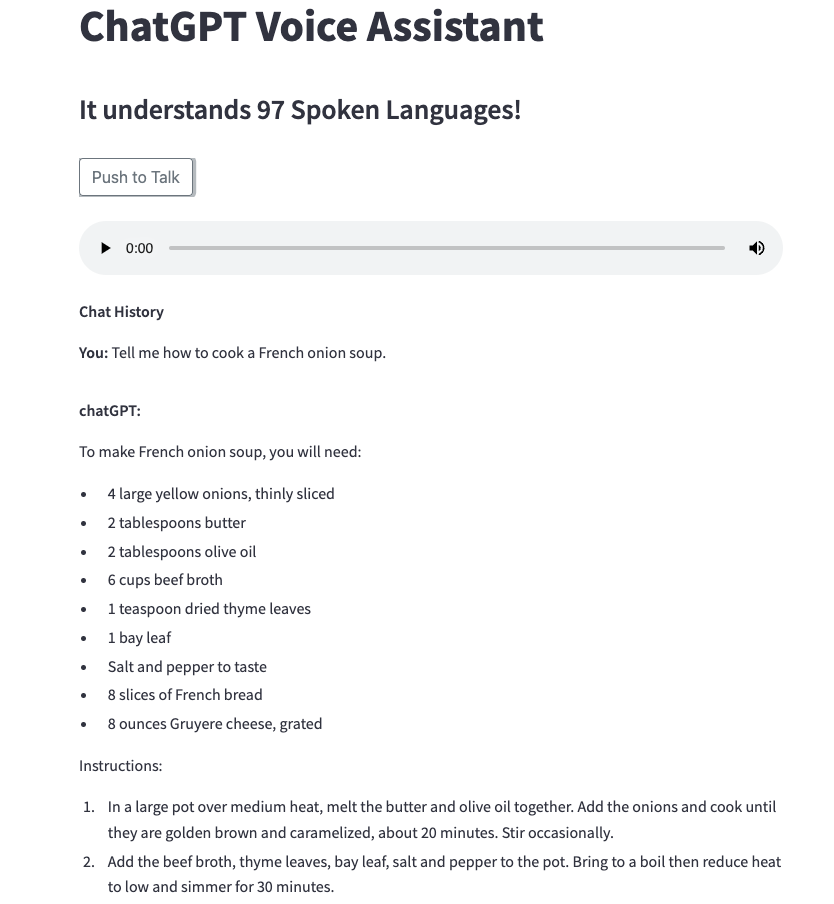

[](https://opensource.org/licenses/MIT) [](http://hits.dwyl.com/mingkuan/voice-assistant-chatgpt)


Welcome to the ChatGPT voice assistant web app, a multilingual solution understanding 97 languages. Powered by OpenAI's Whisper ASR model and chatGPT Large Language Model (LLM).


**Note**:
You need get your own OpenAI API key in order to let the web app to get response from the chatGPT API.

# How to get your own OpenAI API keys
1. Log in to the [OpenAI website](https://openai.com/)
2. Click on your profile picture in the top right corner and select "Dashboard"
3. In the Dashboard, click on "API keys" in the left-hand menu
4. You should see a list of API keys associated with your account. If you haven't generated an API key yet, you can do so by clicking the "New API key" button.

# Running the voice assistant web app

## 1. Run from source code directly
```bash
#checkout the source codes
git clone https://github.com/mingkuan/voice-assistant-chatgpt.git

#install dependencies
pip install -r requirements.txt

#get your OpenAI API key from: https://platform.openai.com/account/api-keys 
#feedin your own OpenAI API key in line#57 in the voicechat.py file.

#start the web app
streamlit run voicechat.py
```
And then open your browser with the URL at http://localhost:8501

## 2. Run from docker container

```bash
# Build the docker container
docker build -t voicebot-chatgpt -f Dockerfile .

# Save your own OpenAPI key into your secret file .env.secrete.txt

# Run the docker container by feed in your API key as environment variable
docker run -it -p 8501:8501  --env-file .env.secrete.txt voicebot-chatgpt
```
And then open your browser with the URL at http://localhost:8501

## 3. Screenshot of the Voice Assistant of chatGPT


